# System Architecture & Design

## High-Level Architecture Diagram

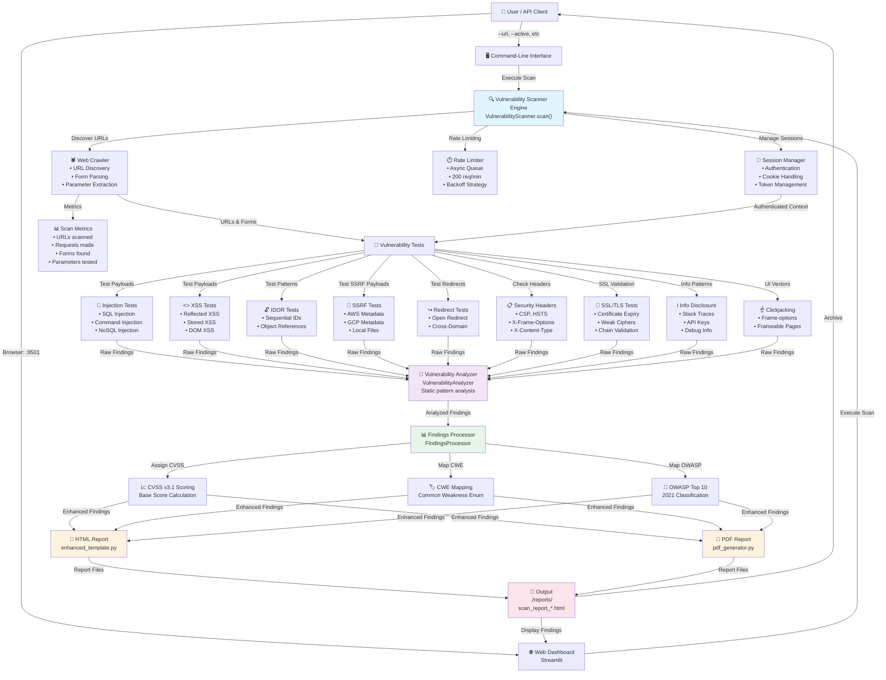

---

## Component Interaction Flow

### Request Processing Pipeline

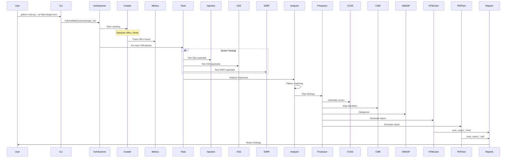

---

## Data Structures

### Finding Object Structure

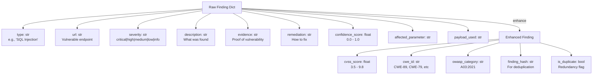

### Scan Results Structure

```
ScanResults {
    "target": "http://example.com",
    "metrics": {
        "scan_duration_seconds": 45.2,
        "total_requests": 312,
        "successful_requests": 298,
        "failed_requests": 14,
        "unique_urls_discovered": 58,
        "forms_discovered": 12,
        "parameters_tested_total": 245,
        "unique_parameters_tested": 89,
        "total_findings": 14,
        "findings_by_severity": {
            "critical": 2,
            "high": 4,
            "medium": 6,
            "low": 2,
            "info": 0
        },
        "findings_by_type": {
            "SQL Injection": 2,
            "XSS": 4,
            "Missing Header": 6,
            "IDOR": 1,
            "SSRF": 1
        },
        "success_rate_percent": 95.5,
        "coverage_percent": 87.3,
        "authenticated_pages_visited": 3,
        "urls_scanned_count": 58
    },
    "findings": [
        { ... finding objects ... }
    ],
    "risk_assessment": {
        "overall_risk": "high",
        "risk_score": 78,
        "critical_findings": 2,
        "high_findings": 4,
        "exploitable_findings": 6
    }
}
```

---

## Scanning Workflow

### Phase 1: Reconnaissance

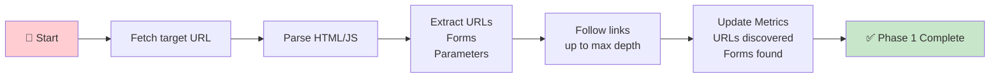

### Phase 2: Vulnerability Testing

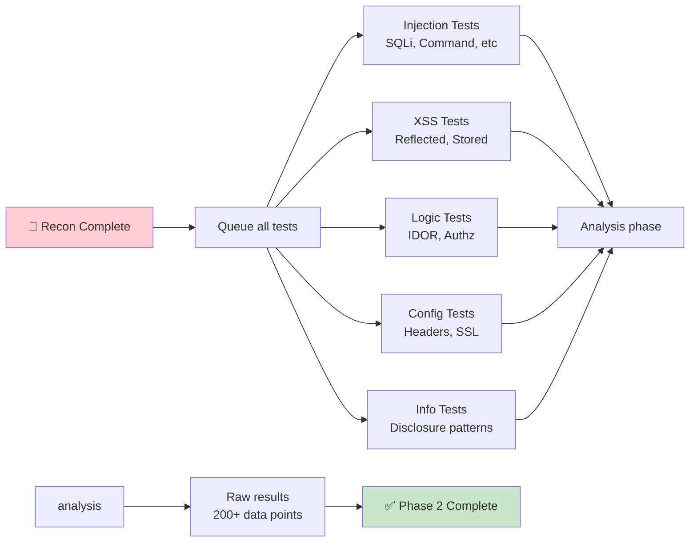

### Phase 3: Analysis & Enhancement

```mermaid
graph LR
    RawFindings["Raw Findings<br/>Detection results"]
    RawFindings --> Dedup["Deduplication<br/>Remove duplicates"]
    Dedup --> CVSS["CVSS Scoring<br/>v3.1 Base Score"]
    CVSS --> CWE["CWE Mapping<br/>Weakness enum"]
    CWE --> OWASP["OWASP Mapping<br/>Top 10 2021"]
    OWASP --> Enhanced["Enhanced Findings<br/>Rich metadata"]
    Enhanced --> Risk["Risk Calculation<br/>Overall score"]
    Risk --> Summary["Executive Summary<br/>Narrative"]
    Summary --> Report["📄 Ready for Report"]
    
    style RawFindings fill:#ffcdd2
    style Report fill:#c8e6c9
```

### Phase 4: Report Generation

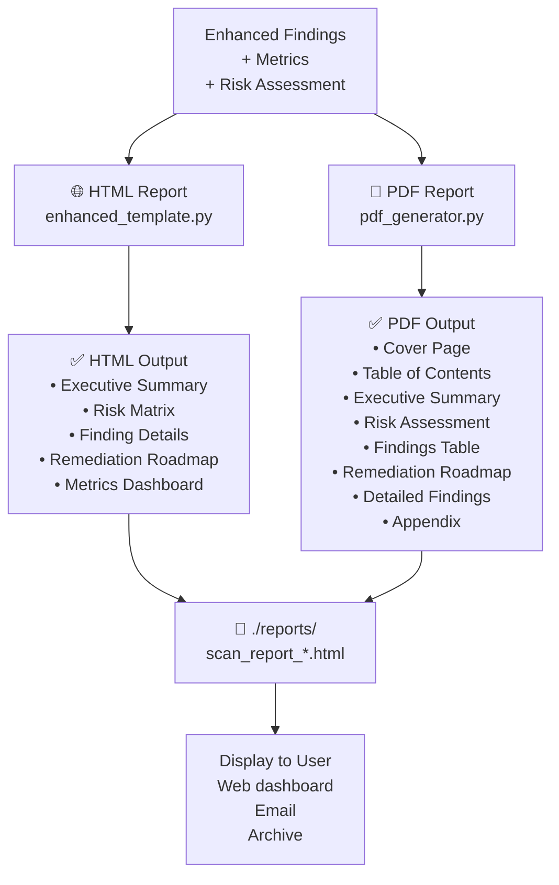

---

## Async Architecture

### Concurrent Request Handling

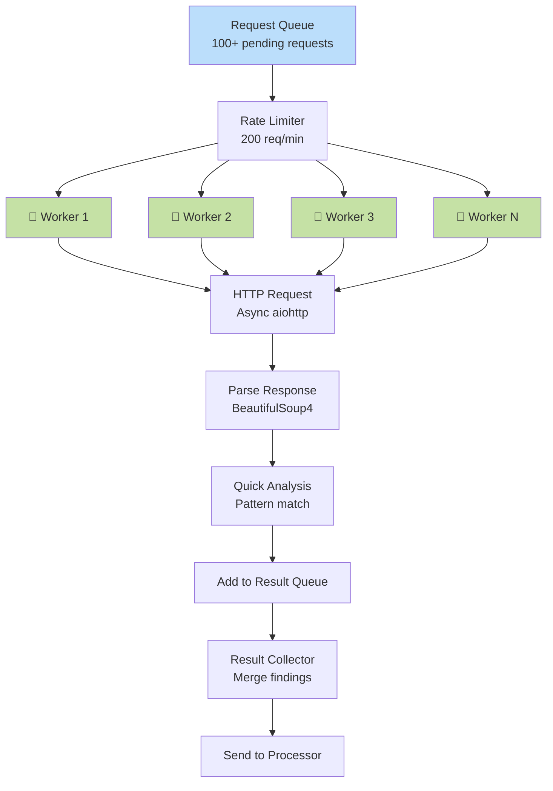

---

## Security & Configuration

### Configuration Hierarchy

```
Environment Variables (highest priority)
    ↓
Command-line Arguments
    ↓
config/scanner_config.yaml
    ↓
Hardcoded Defaults (lowest priority)
```

### Authentication Flow

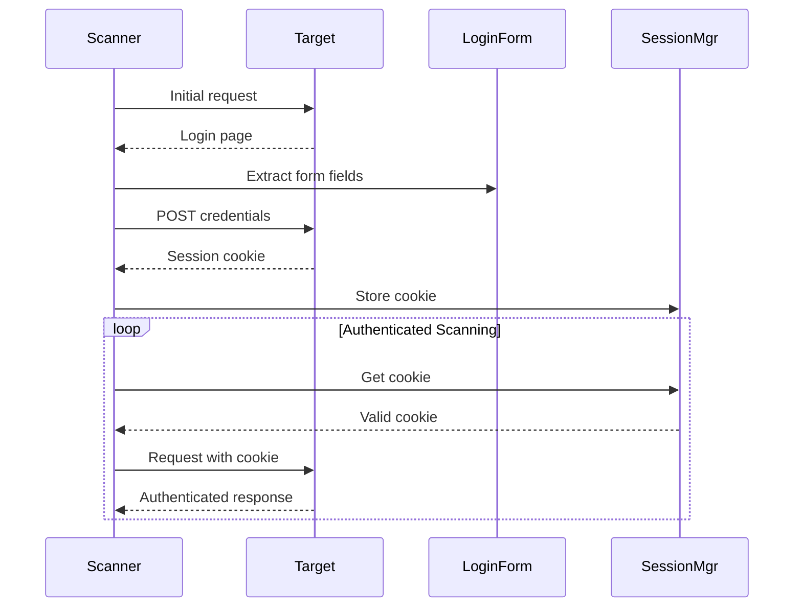

---

## Performance Characteristics

### Scanning Speed Optimization

| Component | Optimization | Result |
|-----------|---|---|
| HTTP Requests | Async concurrency (5 workers) | 3-5x faster than sequential |
| Parsing | BeautifulSoup4 with lxml backend | Fast HTML parsing |
| Analysis | Static pattern matching (re module) | Near-instant detection |
| Rate Limiting | Async queue + exponential backoff | No request overflow |

### Memory Usage Profile

- **Small site** (10-50 URLs): ~50 MB
- **Medium site** (50-200 URLs): ~150 MB
- **Large site** (200+ URLs): ~300-500 MB

### Typical Scan Durations

| Target Size | URLs | Estimated Time |
|---|---|---|
| Small | 5-10 | 30-60 seconds |
| Medium | 50-100 | 2-5 minutes |
| Large | 200-500 | 10-30 minutes |

*(Times vary based on response times and complexity)*

---

## Deployment Architecture

### Local Development

```
Developer Machine
├── Python 3.10 environment
├── scanner code (src/)
├── tests/ (pytest)
├── streamlit_app.py (web dashboard)
└── main.py (CLI)
```

### CI/CD Pipeline (Recommended)

```
GitHub/GitLab
    ↓
[Lint: pylint, black]
    ↓
[Unit Tests: pytest (20+ tests)]
    ↓
[Integration Tests: pytest-asyncio]
    ↓
[Coverage Report: 80%+ required]
    ↓
[Build Artifact]
    ↓
[Deploy to container registry]
```

### Docker Deployment

```dockerfile
FROM python:3.10-slim
WORKDIR /app
COPY requirements.txt .
RUN pip install -r requirements.txt
COPY . .
EXPOSE 8501
CMD ["streamlit", "run", "streamlit_app.py"]
```

---

## Class Hierarchy

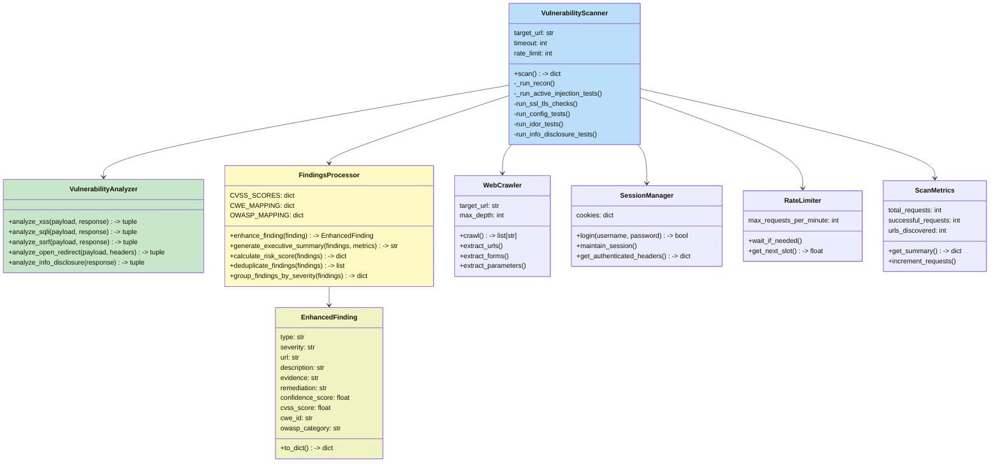

---

## Integration Points

### External Services (Optional)

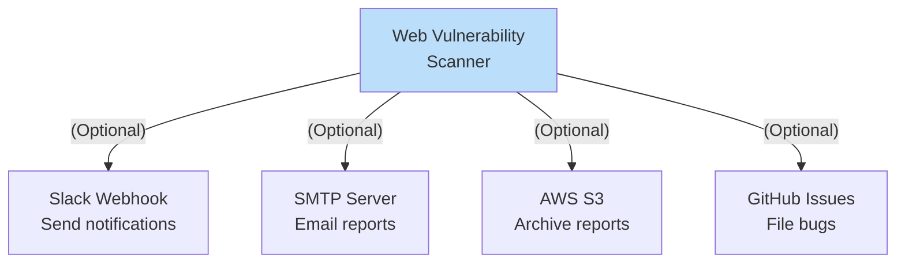

---

## Summary

This architecture provides:

✅ **Modularity** — Each component has single responsibility  
✅ **Scalability** — Async design handles 100+ concurrent requests  
✅ **Maintainability** — Clear data flow and class hierarchy  
✅ **Testability** — Unit and integration test coverage  
✅ **Extensibility** — Easy to add new vulnerability tests or report formats  

Total codebase: **~2,500 lines** across 12 core modules
